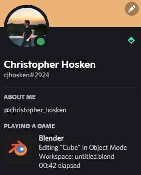

# Blender Rich Presence

Blender Rich Presence is an addon for Blender 3.1+ that lets you show off what you're doing in blender on your Discord profile.

 

## Installation

1. Go to the [Latest Release](../../releases/latest) and download the blender_rpc.zip file. Do *NOT* unzip it.

2. Open Blender, then go to `Edit > Preferences > Add-ons`. Click `Install...` and select the zipfile.

## Credits

Authored and maintained by [Christopher Hosken](https://github.com/Christopher-Hosken).

Based on the fork from [abrasic/blendpresence](https://github.com/abrasic/blendpresence)

## License
[GPL 3.0 License](http://www.gnu.org/licenses/gpl-3.0.html)